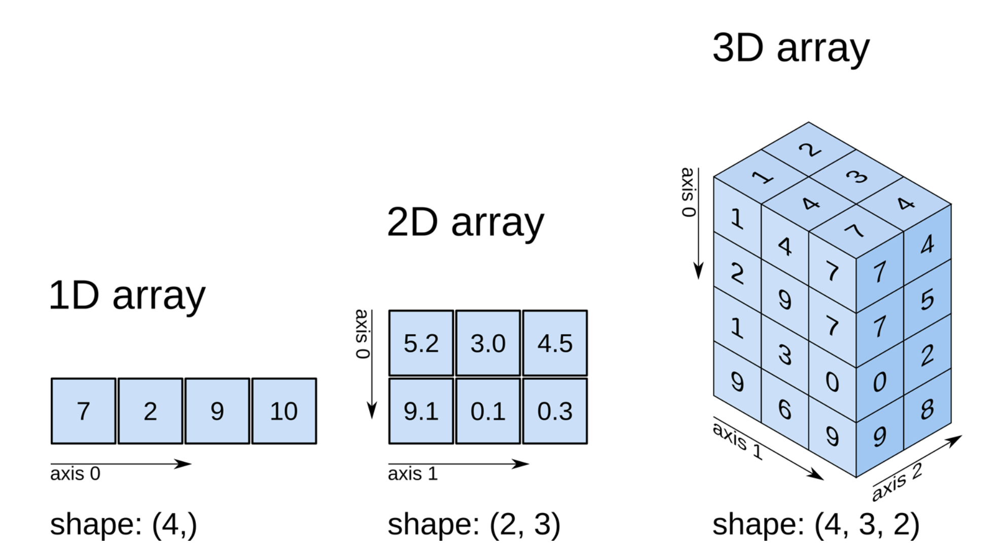
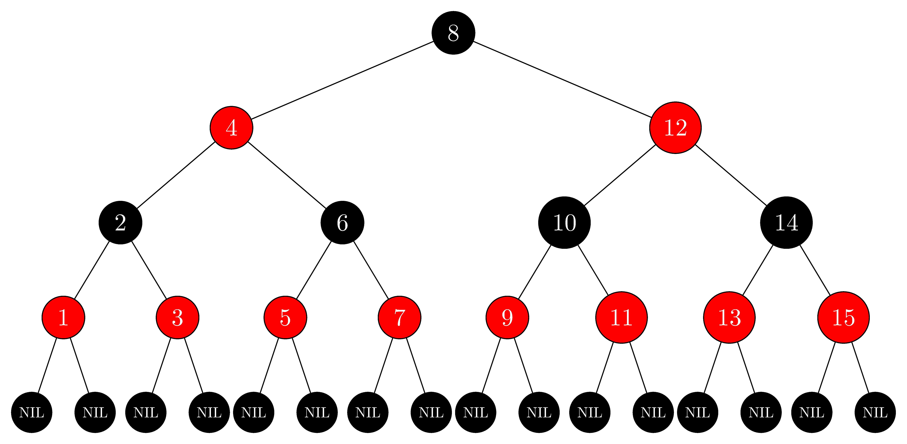

# 07 Collections of Data

!!! info

	To understand how collections work in C++—called containers—it’s essential to be comfortable with pointers and references, as these underpin how elements are stored and accessed in memory.

As programs grow in complexity, working with individual variables quickly becomes impractical.
Often, we need to sort data, search through or loop over it in different ways depending on the situation—and that simply isn’t feasible with standalone variables.

That’s exactly what data collections are for.
They allow us to group and manage related values, following predefined rules based on our needs.

In C++, collections come in the form of STL containers—data structures designed to hold multiple elements of the same or related type.
These structures make it possible to organize, access, and manipulate data in flexible and scalable ways.
Whether you’re storing a list of names, a grid of game tiles, or a queue of tasks to process, these containers provide the right tool for the job.

We've already seen them pop up a few times—C++ containers are templated, which means they use a special syntax with angle brackets to fix the type they store.
This makes them usable with any type.
For example, `std::variant` was one of them—it even took more than one type at once.

Now we’ll explore practical, built-in solutions—like arrays, strings, and powerful containers from the C++ Standard Template Library (STL)—along with the logic behind how they work and how to optimize them.
These implementations are fast, reliable, and used in real-world software every day—so you don’t have to reinvent the wheel.
That said, it’s not uncommon for large companies to use or develop their own versions of the STL, such as EA STL, Qt’s container classes, or Unreal Engine’s custom collections.

## C-Style Arrays

First, we'll look at C-style arrays—one of the most basic, yet surprisingly powerful, data structures in C++.
They originate from the C language (hence the name) and are often referred to as static arrays.

A C-style array is a fixed-size collection of elements stored in contiguous memory, where every element must be of the same data type.
This layout allows for fast access using indexing and straightforward traversal, as shown in the diagram below.

Because all elements are of the same type and placed in continuous memory, they are simply offset by a fixed number of bytes—the size of the data type.
This makes it easy to move from one element to the next just by stepping through memory.

| Index       | 0            | 1            | 2            | 4            | 5            |
| ----------- | ------------ | ------------ | ------------ | ------------ | ------------ |
| Value       | `10`         | `20`         | `30`         | `40`         | `50`         |
| Address     | `0x1000`     | `0x1004`     | `0x1008`     | `0x100C`     | `0x1010`     |

That’s why arrays are incredibly useful when working with multiple related values.
Instead of declaring dozens of individual variables, we can group them together into a single structure—simplifying both storage and access.
For example, initializing 50 elements to zero would be tedious if done manually, but with an array, it’s just a simple loop.

That said, C-style arrays have important limitations.
Their size is fixed at compile time, and they don’t provide built-in bounds checking.
This means it’s easy to accidentally access memory outside the array’s limits, which can lead to bugs or crashes if not handled carefully.

```cpp title="example"
int main() {
	/*
		Declaring multiple separate variables
		is inefficient and repetitive.

		int num1 = 0;
		int num2 = 0;
		int num3 = 0;
		...
	*/
	
	// Use an array to store multiple values efficiently.
	int arr[5];
	
	/*
		This syntax also initializes the array
		immediately after declaration:

		int arr[5] = {0, 0, 0, 0, 0};
	*/
}
```

!!! note

	The syntax `int arr[5];` declares an array and reserves space for five integers, but it does not automatically initialize the elements—they will contain garbage (random) values.

	Also remember that if you initialize the array with values (e.g., `int arr[] = {1, 2, 3};`), you can omit the size.
	In such cases, the compiler determines the size based on the number of elements provided.

### Accessing and Modifying Elements

In the example above, we only allocated memory for five integers.
To change individual elements after declaration, we use an index, which specifies the position of the element in the sequence.
Because of how pointer arithmetic works, the first element is at index 0 not 1—this corresponds to the memory address held by the array variable.
This is because `int arr[]` is treated like a pointer by default.

The syntax for accessing an element is simple: append square brackets to the array name and place the index inside.

```cpp title="main.cpp"
#include <iostream>

int main() {
	int arr[5];
	
	arr[0] = 10; // Assigns 10 to the first element
	arr[2] = 30; // Assigns 30 to the third element
	
	// Access third element for output
	std::cout << "Third element: " << arr[2] << std::endl;
}
```

``` title="output"
Third element: 30
```

!!! danger

	Writing to memory you don't own—beyond the array’s allocated size—leads to undefined behavior, which means your program could do anything from crashing immediately to silently corrupting memory.

	In debug mode, many compilers and runtime environments will catch this and stop the program with a memory access violation.
	But in release mode, it might appear to work fine—until it suddenly doesn't.
	These kinds of bugs are notoriously difficult to track down, so always stay within the bounds of your array and always write index-to-size checks.

### Iterating Over Arrays

Arrays naturally bring us back to loops—because when you have a collection of data, loops are the perfect tool for efficiently stepping through and working with each element.
For example, if we’ve declared an array for five integers, a for loop lets us visit every element and do something with it—like assigning controlled pseudo-random values, since computers can’t really produce truly random numbers.

```cpp title="main.cpp"
#include <iostream>
#include <cstdlib> // for std::srand and std::rand
#include <ctime>   // for std::time

int main() {
	int array[5];
	
	/* 
		Seed the random number generator with the current time
		to ensure different sequences of numbers each run
	*/
	std::srand(std::time(nullptr));

	for (int i = 0; i < sizeof(array) / sizeof(array[0]); ++i)
		// Generate a pseudo-random number between 0 and 100 (inclusive)
		array[i] = std::rand() % 101;

	for (int i = 0; i < sizeof(array) / sizeof(array[0]); ++i)
		std::cout << array[i] << '\t';
}
```

``` title="output"
65	30	83	46	92
```

In this example, we utilized the `sizeof` operator in the loop condition to determine the number of elements in the array.
This ensures the loop runs exactly once per element, keeping our code safe and adaptable if the array size changes.

!!! tip

	This example uses the C-style `std::rand()` function to generate pseudo-random numbers.
	While it’s simple and widely supported, it’s considered outdated in modern C++.
	For better randomness, control, and features, check out the C++ `<random>` header introduced in C++11.
	It provides more powerful and flexible tools to generate random numbers—including floating-point values and more—in a safer and more efficient way.

	More on that topic can be found here: <a href="https://cplusplus.com/reference/random/" target="_blank" rel="noopener noreferrer">https://cplusplus.com/reference/random/</a>

### Pointers Arithmetic on Arrays

It’s important to understand that arrays are tightly related to pointers.
In fact, the array variable itself acts as a pointer to the first element of the array.
So when you print just the array’s name, what you’re really seeing is the memory address of the first element.

If we increment that pointer by one, it doesn’t move forward by one byte—it moves forward by the size of the type it points to.
For an `int` array, this usually means 4 bytes per step (on most systems).

```cpp title="main.cpp"
#include <iostream>

int main() {
	int array[3] = {1, 2, 3};
	
	int* ptr = array; // Points to the first element
	
	std::cout << "First element: " << *ptr << std::endl;
	
	++ptr;            // Advances the pointer by 4 bytes
	
	std::cout << "Second element: " << *ptr << std::endl;
}
```

``` title="output"
First element: 1
Second element: 2
```

### Array Heap Allocation

Until now, we've declared arrays on the stack, meaning they're automatically managed and cleaned up when they go out of scope.
However, we can use the `new` keyword to allocate an array on the heap, which gives us full control over its lifetime.

```cpp title="example"
int main() {
	int* array = new int[5];
	delete[] array;
}
```

Since this array was allocated on the heap, it won't be automatically deallocated when the function ends.
It will persist until we manually free it using `delete[]`, or until the program terminates.

!!! danger

	If we allocate an array on the heap inside a function and forget to free it before the function ends, we lose access to that memory address—resulting in a memory leak.
	Once it's out of scope with no pointer referencing it, there's no way to clean it up anymore.

### Multidimensional Arrays

The term multidimensional refers to arrays with more than one level of indexing.
Whether it’s 2D, 3D, or more, the underlying concept stays the same: a multidimensional array is simply an array of arrays and so on.
This structure allows us to represent its elements like grids, matrices, or tables.



Since arrays are essentially pointers, a multidimensional array can be viewed as a pointer to a pointer—each pointer in the top-level array refers to another block of memory that holds the actual data.
This hierarchical structure lets us organize data in rows, columns, and beyond.


#### Dynamically Allocating a 2D Array

To properly create a 2D array on the heap:

- Allocate memory for an array of pointers (the rows).
- Loop through each pointer and allocate a separate array for that row.

```cpp title="example"
int main() {
	/*
		Allocate a 2D array on the heap using a pointer-to-pointer
		This helps illustrate how 2D arrays work under the hood
	*/
	int** array2d = new int*[50];  // 50 rows

	for (int i = 0; i < 50; ++i)
		array2d[i] = new int[10]; // Each row has 10 columns
	
	/*
		However, it's better to use a stack-allocated 2D array if possible
		int array2d[2][3] = {{1, 2, 3},
							 {4, 5, 6}};
	*/
}
```

Each `array2d[i]` now points to a 1D array of integers, giving us a full 50×10 grid of values.

#### Deallocating a 2D Array

Each row is dynamically allocated separately, allowing for flexible memory management.
However, since we are manually allocating memory, we must also free it later to prevent memory leaks.

!!! danger

	When deallocating a multidimensional array, we cannot simply use `delete[] array2d` because that would only free the top-level pointer, leaving the allocated rows still in memory and causing a memory leak.

To properly free a dynamically allocated 2D array, we must:

1. Iterate through the first dimension and delete each row.
2. Once all rows are freed, delete the main array pointer.

```cpp title="example"
int main() {
	int** array2d = new int*[50];
	
	for (int i = 0; i < 50; ++i)
		array2d[i] = new int[10];
	
	for (int i = 0; i < 50; ++i)
		delete[] array2d[i];
		
	delete[] array2d;
}
```

#### Access multidimensional arrays

To access elements in a multidimensional array, we extend our understanding of indexing.
The first `[]` selects a row (an array), and the second `[]` selects a column (element within that row).

```cpp title="main.cpp"
#include <iostream>

int main() {
	int array2d[3][3] = {
		{1, 2, 3},
		{4, 5, 6},
		{7, 8, 9}
	};

	std::cout << "Second row, third column: " << array2d[1][2] << std::endl;
}
```

``` title="output"
Second row, third column: 6
```

In this example, we demonstrated how to allocate a multidimensional array on the stack.
This approach is much simpler, but it doesn’t reveal how multidimensional arrays actually work under the hood.
That’s why we only introduced it at this point—once the fundamentals were already in place.

#### Optimizing Memory Access for Multidimensional Arrays

Multidimensional arrays do not store their data in a single contiguous memory block by default.
Instead, they typically allocate multiple smaller buffers scattered across memory, leading to memory fragmentation, where data is no longer stored sequentially.
This fragmentation causes inefficient memory access, as the CPU must jump between different memory locations—resulting in increased overhead and slower performance.

One way to optimize this is by improving cache locality, which minimizes costly memory jumps by keeping related data close together in memory.

It might seem like there's no easy fix for this, but there actually is.
If we know the dimensions of the array ahead of time, we can allocate a single contiguous block of memory (i.e., a one-dimensional array) and manually compute row and column indices to simulate multidimensional access.

This approach avoids the overhead of multiple `new` allocations and takes better advantage of the CPU cache.
Additionally, allocating the array on the stack (when size is known and small enough) instead of dynamically on the heap further improves performance and memory safety.

```cpp title="main.cpp"
#include <iostream>

int main() {
    int rows = 50, cols = 10;
    int* array = new int[rows * cols];
	
    // Accessing elements using index calculations
    int row = 2, col = 3;
    array[row * cols + col] = 42;
	
    std::cout << "Value at [" << row << "][" << col << "]: " 
			  << array[row * cols + col] << std::endl;
	
    delete[] array;
}
```

``` title="output"
Value at [2][3]: 42
```

This method ensures that all elements are stored in a single contiguous memory block, reducing fragmentation and significantly improving performance.
Whenever possible, prefer this approach to optimize memory access and cache efficiency.

Even when you imagine an image as a multidimensional array of pixels, it isn't, it is just a single-dimensional array stored in memory.
The concept of rows and columns is simply an abstraction used for easier indexing and manipulation.

## Strings

Strings—or text in general—are a surprisingly complex topic in computing, largely due to character encoding and how characters are represented in memory.
By default, C++ uses the `char` type to represent individual characters, typically assuming an ASCII-compatible encoding, such as UTF-8.

However, ASCII has a major limitation: it uses only 1 byte per character, giving just 256 possible values.
That’s nowhere near enough to represent the thousands of characters used across different languages and symbol sets.

To solve this, modern encodings like Unicode and especially UTF-8 were introduced.
These allow much broader and more flexible character representation, supporting virtually all human languages.

From a structural point of view, strings are closely related to arrays, because they both act as buffers of a specific type.
In fact, a basic string in C and C++ is just an array or pointer of `char` values stored contiguously in memory.

### C-Style String

We briefly encountered this style of string in the earlier chapters—for example, when using `std::cout`—but we didn’t stop to examine how it actually works.
Now that we have the necessary background on arrays, pointers, and memory, we can finally explore it in more detail.

```cpp title="main.cpp"
int main() {
	const char* string = "Hello World!";
	
	std::cout << string << std::endl;
}
```

In the example above, a few important things are happening:

- The string is written using double quotes, which tells the compiler to create a string literal—a fixed, read-only block of characters.
- The variable is declared as `const char*`, meaning it’s a pointer to a constant character buffer.
  This pointer points to the beginning of the string literal, which is stored in read-only memory.
- The `const` is important—it prevents accidental modification of the string.
  If you try to change a string literal, you’ll get undefined behavior, and many compilers will crash the program to protect memory.

One key detail about string literals is that they are null-terminated.
Behind the scenes, the compiler automatically adds a special character, `\0`, to the end of the string.
This marks where the string ends in memory.

| Index | 0   | 1   | 2   | 3   | 4   | 5    |
| ----- | --- | --- | --- | --- | --- | ---- |
| Value | H   | e   | l   | l   | o   | \0   |

Without that null character, functions like `std::cout` wouldn’t know when to stop reading characters, and you'd likely end up printing garbage data—or crashing your program.

#### Modifying C-Style Strings

If you want a string that you can modify, you need to create it differently.
Rather than pointing to a read-only literal, you allocate a character array that lives in stack memory.

```cpp title="main.cpp"
int main() {
	char string[] = "Hello World!";
	
	string[1] = 'a';
}
```

This creates a mutable copy of the string.
Each character is stored in stack memory, and you can safely modify it.
The null terminator is still added at the end automatically.

### C++ String

!!! info

	The `std::string` API provides solutions for nearly all string-related problems.
	Covering every possible edge case and method here would be unnecessary.
	If you need a specific solution, you can refer to the C++ documentation available here: <a href="https://cplusplus.com/reference/string/string/" target="_blank" rel="noopener noreferrer">https://cplusplus.com/reference/string/string/</a>

Now that we’ve explored C-style strings and how they work under the hood, it’s time to introduce the more modern and user-friendly C++ alternative: `std::string`.

C++ provides a powerful templated class called `std::string` for handling and manipulating text.
Internally, it still uses a `char` array as its underlying data structure, but it wraps that low-level complexity in a much more intuitive and safer interface.

To use `std::string`, we include the `<string>` header, which defines the class and its methods.
While `std::string` can technically be used with just `<iostream>`, doing so doesn’t give you full access to all of its functionality—so it’s best practice to explicitly include `<string>`.

```cpp title="main.cpp"
#include <iostream>
#include <string>

int main() {
	std::string string = "Hello World!";
	
	std::cout << string << std::endl;
}
```

``` title="output"
Hello World!
```

This example shows a simple way to declare and print a string in C++.
Behind the scenes, `std::string` automatically handles memory allocation, resizing, copying, and null-termination for you.

#### String Concatenation

With `std::string`, concatenating text is simple.
We can use the `+=` operator to append new content, or use the `.append()` method for a more explicit and readable approach.
Both options do the same thing—it’s just a matter of preference.

```cpp title="main.cpp"
#include <iostream>
#include <string>

int main() {
    std::string string = "Hello World!";

    string += " Another string!";
    string.append(" Yet another string!");

    std::cout << string << std::endl;
}

```

``` title="output"
Hello World! Another string! Yet another string!
```

The problem arises when we try to concatenate two string literals, as they are both raw C-style `const char*` values.
Since these are pointers to character arrays, there's no built-in + operator to add two `const char*` values together.
In other words, C++ doesn’t know how to "add" two pointers and produce a combined string.

```cpp title="main.cpp"
#include <iostream>
#include <string>

int main() {
	std::string string = "Hello " + "World!";
}
```

``` title="output"
error: invalid operands
```

To fix this, you need to convert at least one of them to `std::string`, type which knows how to handle dynamic memory and concatenation.

```cpp title="main.cpp"
#include <iostream>
#include <string>

int main() {
	std::string message = std::string("Hello ") + "World!";

	std::cout << message << std::endl;
}
```

``` title="output"
Hello World!
```

There's also a shortcut: if you're just trying to break a long string across multiple lines or connect with a definition, C-style string literals placed next to each other automatically merge at compile time.
This works without any concatenation operator.

```cpp title="main.cpp"
#include <iostream>

#define RESOURCES_PATH "assets/"

int main() {
	const char* path = RESOURCES_PATH
	                   "textures/"
	                   "player.png";

	std::cout << path << std::endl;
}

```

``` title="output"
assets/textures/player.png
```

### String Literals

!!! danger

	Modifying a string literal like leads to undefined behavior, because literals are stored in read-only memory.

Now that we've learned how to store and manipulate text, it's time to cement our understanding of what string literals actually are.

A string literal is a sequence of characters enclosed in double quotes.
In C++, these are stored as pointers to arrays of `char` values, and they are automatically null-terminated—meaning a special character is placed at the end to signal where the string stops.

In contrast, a character literal is written inside single quotes and represents a single char value.

```cpp title="main.cpp"
int main() {
    char character = 'A';      // Single character
    const char* string = "A";  // Null-terminated C-string {'A', '\0'}
}
```

Although both contain single character `A`, the first is a single character stored in a single byte, while the second is a pointer to a two-character array: `'A'` followed by `'\0'`.
This distinction matters, especially when performance or memory layout is important.
If you only need one character, avoid using a full string literal—it's less efficient and potentially misleading.

#### Raw String Literals

Sometimes, escape sequences like `\n`, `\t`, or `\\` get in the way—especially when working with file paths, regular expressions, or JSON.
To help with this, C++ offers raw string literals, written using `R"(...)"`.
Inside the parentheses, everything is treated as plain text without interpreting escape sequences.
This removes the need for double backslashes and other annoying escapes.

```cpp title="main.cpp"
#include <iostream>
#include <string>

int main() {
	std::string raw_string = R"(C:\Users\UserName\Documents\file.txt)";

	std::cout << raw_string << std::endl;
}
```

``` title="output"
C:\Users\UserName\Documents\file.txt
```

#### Unicode String Literals

!!! warning

	As mentioned earlier, non-ASCII characters can cause compatibility issues across different system architectures.
	Unless you're working on a graphical user interface (GUI) or an application that explicitly requires Unicode, it's often better to avoid using non-ASCII characters in general-purpose or console-based programs.

C++ also supports Unicode and wide character string literals, which are essential for representing characters outside of ASCII (like emoji, accented letters, or non-Latin scripts).
These literals use prefixes to indicate encodings.

| Prefix | Type       | Encoding                     | Notes                      |
| ------ | ---------- | ---------------------------- | -------------------------- |
| `L""`  | `wchar_t`  | Platform-defined (UTF-16/32) |                            |
| `u""`  | `char16_t` | UTF-16                       | Fixed 2 bytes per char     |
| `U""`  | `char32_t` | UTF-32                       | Fixed 4 bytes per char     |
| `u8""` | `char`     | UTF-8                        | Same type as `std::string` |

### Small Strings

Strings are a foundational part of programming, and while they’re often convenient to use, they carry a reputation for being slow.
This is mostly due to frequent memory allocations on the heap, which are slower than stack allocations.

To address this, modern implementations of `std::string` include an optimization called Small String Optimization (SSO).
This technique avoids heap allocation for small strings by storing them directly on the stack.

!!! note

	The exact size limit for SSO varies between implementations.
	For instance, Microsoft’s Visual C++ (MSVC) stores strings up to 15 characters on the stack.
	Longer strings are allocated on the heap.

This optimization is transparent to the user and one of the main reasons `std::string` is preferred over C-style strings in modern C++.

### Optimize Strings in C++

As noted, frequent heap allocations are the main source of performance overhead.
While not inherently bad, heap allocations are relatively expensive, especially inside performance-critical loops.

```cpp title="main.cpp"
#include <iostream>
#include <string>

static unsigned int s_alloc_count = 0;

void* operator new(size_t size) {
    s_alloc_count++;
    std::cout << "Allocating: " << size << " bytes" << std::endl;
    return malloc(size);
}

void operator delete(void* memory, size_t size) {
    std::cout << "Deallocating: " << size << " bytes" << std::endl;
    free(memory);
}

void PrintNameReference(const std::string& name) {
    std::cout << name << std::endl;
}

int main() {
    std::string small_string = "Unknown Name";        // Stack allocation
    std::string large_string = "Unknown Name Longer"; // Heap allocation
    PrintNameReference(large_string);
	
    std::cout << "Total Allocations: " << s_alloc_count << std::endl;
}
```

``` title="output msvc debug"
Allocating: 16 bytes -> small_string
Allocating: 16 bytes -> large_string metadata
Allocating: 32 bytes -> large_string content

Random Jordan Second
Total Allocations: 3

Deallocating: 32 bytes -> large_string content
Deallocating: 16 bytes -> large_string metadata
Deallocating: 16 bytes -> small_string
```

``` title="output msvc release"
Allocating: 32 bytes

Random Jordan Second
Total Allocations: 1

Deallocating: 32 bytes
```

The Small String Optimization typically applies in release mode with the Microsoft Visual C++ compiler.
In Debug mode, MSVC disables many optimizations and adds extra bookkeeping (like iterator debugging and guard buffers), which often prevents SSO from activating.

Interestingly, the same allocation behavior occurs even if we don’t explicitly create a `std::string` variable, and instead pass a string literal directly to a function.
That’s because a temporary `std::string` is still constructed behind the scenes from the literal.

```cpp
PrintNameReference("Random Jordan Second");
```

#### Substring Operations Overhead

Problems can arise when manipulating strings—such as extracting substrings—because each operation typically results in a new string which needs another heap allocation.
This can introduce performance overhead, especially when used inside loops or performance-critical code.

```cpp title="main.cpp"
/*
	Operator overloads for memory tracking from example before
	PrintName function implementation 
*/

int main() {
    std::string name = "Unknown Name Longer";
	
    std::string firstName = name.substr(0, 6);
    std::string lastName = name.substr(8, 17);
	
    std::cout << "Total Allocations: " << s_alloc_count << std::endl;
}
```

``` title="output msvc debug"
Allocating: 16 bytes
Allocating: 16 bytes
Allocating: 16 bytes

Total Allocations: 3

Deallocating: 16 bytes
Deallocating: 16 bytes
Deallocating: 16 bytes
```

When we extract portions of an existing string using substr, each call results in a new `std::string` being constructed.
This means a fresh heap allocation is performed, and the relevant characters are copied from the original string into the new one.
While this might seem harmless in small, isolated cases, it introduces unnecessary overhead.

The root of the issue is how `std::string::substr` behaves: it always returns a new string, rather than referencing a slice of the original.
Even if we pass that substring directly to a function, a temporary string is still created behind the scenes, leading to the same allocation cost.

#### String Views

To avoid these allocations, we need a way to reference a substring without copying it.
This is exactly what the C++ Standard Library offers with `std::string_view`.
Unlike `std::string`, a `string_view` is a non-owning view into an existing character sequence.
It performs no allocations and provides a lightweight, efficient way to work with substrings.

```cpp  title="main.cpp"
// Operator overloads for memory tracking from example before

void PrintNameView(std::string_view name) {
	std::cout << name << std::endl;
}

int main() {
    std::string name = "Unknown Name";

    std::string_view first_name(name.c_str(), 6);
    std::string_view last_name(name.c_str() + 8, 4);

    PrintNameView(first_name);
    PrintNameView(last_name);

    std::cout << "Total Allocations: " << s_alloc_count << std::endl;
}
```

``` title="output"
Allocating: 16 bytes
Unknow
Name
Total Allocations: 1
Deallocating: 16 bytes
```

By switching to `std::string_view`, we’ve reduced the number of heap allocations down to just one—the one used to create the original `std::string`.
Since view doesn’t copy data, it allows us to reference parts of the string without triggering additional allocations.

Instead of calling substring, we now construct `std::string_view` objects directly.
The constructor takes two arguments:

1. A starting pointer position – typically provided by `name.c_str()`, which gives access to the underlying character data.
2. A length – indicating how many characters to include starting from the pointer you provided.

Since `c_str()` returns a `const char*`, we can use pointer arithmetic (like name.c_str() + 7) to adjust the starting point of the view dynamically.

To support this approach, we also have to create new function to accept a `std::string_view` instead of a full `std::string`, ensuring that no temporary allocations occur when passing substrings around.

But we can go even further—down to zero allocations—by skipping `std::string` entirely.
If we declare the original string as a plain `const char*`, we avoid heap usage altogether.
These literals are stored in static memory (often embedded directly in the binary), and don't trigger any heap allocations which are tracked by `s_alloc_count`.

```cpp title="main.cpp"
// Operator overloads for memory tracking from example before
// PrintNameView function

int main() {
    const char* name = "Unknown Name Longer";

    std::string_view first_name(name, 6);
    std::string_view last_name(name + 8, 4);

    PrintNameView(first_name);
    PrintNameView(last_name);

    std::cout << "Total Allocations: " << s_alloc_count;
}
```

``` title="output"
None
```

Since it's already a `char*` pointer, we can simply pass the variable `name` instead of using `c_str()`.

!!! note

	If we need to mutate the string, `char*` is no longer an option, as `char*` is non-modifiable strings in this context.

## C++ Static Array

Earlier in this chapter, we referred to the C-style array—also known as a static array—and mentioned how it has a fixed size that cannot be changed after its declaration.
Now, let’s focus on the C++ Standard Library's static array: `std::array`.
While it shares the fixed-size nature of C-style arrays, it offers several advantages that make it more practical and safer to use in modern C++.
To use `std::array`, simply include the `<array>` header.

```cpp title="main.cpp"
#include <iostream>
#include <array>

int main() {
	std::array<int, 5> array;
	array[0] = 1;
	array[4] = 5;

	// Easily access array size as count of elements
	std::cout << array.size();
}
```

``` title="output"
5
```

This example shows how to declare a static array using `std::array` and access its elements.
The interface is quite similar to C-style arrays, but with additional functionality.

`std::array` takes two template parameters:

1. The type of elements it stores
2. The size (number of elements)

```cpp title="main.cpp"
#include <iostream>
#include <array>

void PrintArray(const std::array<int, 5>& array) {
    for (int i = 0; i < 5; ++i)
        std::cout << array[i] << '\t';
}

int main() {
    std::array<int, 5> array = {}; // Zero-initialize all elements
    array[0] = 1;
    array[4] = 5;

    PrintArray(array);
}
```

``` title="output"
1	0	0	0	5
```

One limitation is clear in this example: the size of the array (5) must be part of the function's type signature, which reduces flexibility and modularity.
Later with templates, we’ll learn how to solve this by templating the function itself.

Alternatively, if you need a resizable container, you may want to use a dynamic array such as `std::vector` instead.

Despite this constraint, `std::array` introduces no performance overhead compared to raw arrays.
In return, you get stronger type safety and better integration with the STL.
For these reasons, it should be preferred over C-style arrays in modern C++ code.

## Dynamic Array

!!! info

	We won’t go into every feature of `std::vector` here, as it’s a large and powerful tool.
	For more tailored usage, refer to the documentation: <a href="https://cplusplus.com/reference/vector/vector/" target="_blank">cplusplus.com/reference/vector/vector</a>

When we need a C++ container that can resize by adding or removing elements during runtime, the Standard Library provides a dynamic array implementation called `std::vector`.
Its key feature is exactly what we’d expect from a dynamic container: automatic resizing, making it ideal when the number of elements isn’t known in advance or is expected to change over time.

Under the hood, a vector manages memory dynamically.
The actual element data is stored on the heap, while the vector object itself—along with its pointer to the data, current size, and capacity—is stored on the stack.

As you add elements, the vector will automatically expand its internal storage when needed.
For example, if a vector initially reserves space for 10 elements and you push more, it will:

1. Allocate a new, larger block of memory (usually doubling the capacity)
2. Copy the existing elements into the new memory
3. Release the old memory
4. Update its internal pointer to point to the new block

Just like `std::array`, vectors support indexing, range-based loops, and all the common STL algorithms like sorting and searching.
The big difference is that you don’t need to define the size ahead of time.

To use vectors in your project, include the `<vector>` header from the Standard Library.

```cpp title="main.cpp"
#include <iostream>
#include <vector>

int main() {
	std::vector<int> dynamicArray = {58, 11, 94, 36, 77};
	dynamicArray.push_back(63);

	std::cout << dynamicArray[5] << std::endl;
}
```

``` title="output"
63
```

By default, `std::vector` stores its elements in a contiguous block of memory on the heap, not as separate pointers.
The vector object itself—including its size, capacity, and a pointer to its data—is kept on the stack when the vector is declared as a local variable.

For complex types like structures, the objects themselves are still stored directly within the vector's memory block, not just pointers to them.
This means that whenever the vector resizes, each object is moved into the new memory block, which can introduce performance overhead depending on how expensive those moves are.

```cpp title="example"
int main() {
	int* static_array1 = new int[500000];
	std::array<int, 500000> static_array2;
}
```

In this example, we allocate a large array both heap and stack.
While pre-allocating a large array might seem like a way to avoid future resizing, it introduces some serious risks.

| Issue               | Description                                                                                                                                             |
| ------------------- | ------------------------------------------------------------------------------------------------------------------------------------------------------- |
| Stack Overflow      | `std::array<int, 500000>` is allocated on the stack, which has limited space (typically around 2 MB). Exceeding this causes an immediate crash.         |
| Heap Exhaustion     | `new int[500000]` allocates memory on the heap, which has more space than the stack, but can still run out if memory is low or overused.                |

While vectors offer a safe and flexible way to manage dynamic arrays, they aren’t magic—they still rely on memory allocations and must be used wisely.

### Vector Optimization

Now that we understand how `std::vector` works internally—especially its dynamic resizing behavior—we can take it a step further and discuss how to use it more efficiently.

Optimizing performance in C++ often means understanding what’s happening under the hood.
In the case of vectors, that includes how memory is managed, how elements are copied or moved, and how frequently reallocation occurs.

Whenever you add elements to a vector that has reached its capacity, it must allocate a larger memory block to accommodate the new data.
It then copies all existing elements into the new block, deallocates the old memory, and updates its internal pointer.
This reallocation process happens automatically as needed, but if triggered too often, it can introduce significant performance costs.

By default, a vector typically grows its capacity by around 50% of the previous one when resizing.
While this amortizes the cost across many insertions, frequent resizes can still slow things down—especially when dealing with large amounts of data or non-trivial object types.

```cpp title="main.cpp"
#include <iostream>
#include <vector>

class Vertex {
public:
	float x;
	float y;
	float z;
	
	Vertex() = default;
	
	Vertex(float x, float y, float z)
		: x(x), y(y), z(z) {
	}
	
	Vertex(const Vertex& vertex)
		: x(vertex.x), y(vertex.y), z(vertex.z) {
		std::cout << "Copied!" << std::endl;
	}
};

int main() {
	std::vector<Vertex> vertices;

	vertices.push_back(Vertex(1, 2, 3));
	vertices.push_back(Vertex(4, 5, 6));
	vertices.push_back(Vertex(7, 8, 9));
}
```

``` title="output"
Copied!
Copied!
Copied!
Copied!
Copied!
Copied!
```

Let’s break down what’s happening in the example above.
When running this code, you'll see six copy operations—even though we're only adding three elements.
This might seem surprising at first, but it reveals two important areas where we can optimize our use of `std::vector`.

The first issue is how we're adding elements.
When we write it as is we're creating a temporary `Vertex` object and then copying it into the vector.
Even though the construction happens inside the `push_back` call, it's still a two-step process: first, the object is constructed, then it’s copied into the vector.
This accounts for three copies—one for each object we add.

The second problem stems from how `std::vector` handles its memory.
When we don’t specify a capacity ahead of time, the vector starts with a small default capacity (often 2, depending on the implementation).
As we add more elements, the vector must resize itself.
Each time this happens, it allocates new memory, copies all existing elements into the new block, and deallocates the old one.
Since we’re adding three elements and the initial capacity isn't sufficient, we trigger at least one reallocation, which causes the existing elements to be copied again.
That’s another three copies, bringing the total to six.

To prevent these unnecessary copies, there are two simple optimizations we can apply:

1. Reserve memory ahead of time: If we know how many elements we'll add, we can call `.reserve()` on the vector before inserting data.
   This ensures enough space is allocated up front, so no reallocations are needed during insertion.
2. Construct in-place: Instead of using `push_back`, use `emplace_back`, which constructs the object directly inside the vector, avoiding the temporary copy.

```cpp title="main.cpp"
#include <iostream>
#include <vector>

class Vertex {
public:
    float x;
    float y;
    float z;

    Vertex() = default;

    Vertex(float x, float y, float z)
        : x(x), y(y), z(z) {
    }

    Vertex(const Vertex& vertex)
        : x(vertex.x), y(vertex.y), z(vertex.z) {
        std::cout << "Copied!" << std::endl;
    }
};

int main() {
    std::vector<Vertex> vertices;
    vertices.reserve(3);

    vertices.emplace_back(1, 2, 3);
    vertices.emplace_back(4, 5, 6);
    vertices.emplace_back(7, 8, 9);
}
```

``` title="output"
None
```

It's also worth noting that there is another way to initialize a vector with a default size, but it is not as efficient.
While the `reserve` method is more explicit and better, it can be substituted with syntax where we specify the vector's size directly in the constructor.
This not only reserves memory but also defaultly initializes the elements (e.g., filling an integer vector with zeros or a string vector with empty strings).

```cpp title="example"
std::vector<Vertex> vertices(3);
```

However, this method should be used with caution because, although it avoids reallocations, it still results in unnecessary copies.
Specifically, using this approach would create 3 copies in this context, as we are assigning values after initialization.
Instead, using `emplace_back` is the more efficient way to handle this situation.

## HashMap

!!! info

	As always, we won’t cover every single operation available for C++ maps here—our focus is on understanding how they work logically.
	For a complete list of functionalities, refer to the documentation:

	- <a href="https://cplusplus.com/reference/map/map/" target="_blank">https://cplusplus.com/reference/map/map/</a>
	- <a href="https://cplusplus.com/reference/unordered_map/unordered_map/" target="_blank">https://cplusplus.com/reference/unordered_map/unordered_map/</a>

Sometimes, we need more than just a list of values.
We want to associate one piece of data with another—like a name with a phone number, or a username with a score.
This is for what associative containers, also known as maps, are for.

Unlike arrays or vectors, which use numeric indices to access elements, maps store key–value pairs.
You provide a unique key, and the map returns the corresponding value.
This means maps are ideal when you need fast access to specific elements, especially when you don’t care about the order of the data.

In C++, the Standard Library provides two main types of maps.

| Type                 | Description                                                                   |
| -------------------- | ----------------------------------------------------------------------------- |
| `std::map`           | A sorted map implemented using a self-balancing red-black tree.               |
| `std::unordered_map` | A hash table that offers faster lookups by using a hashing algorithm.         |


A `std::map` keeps its keys in sorted order using a red-black tree under the hood.
Each time you insert or search for a key, it traverses the tree by comparing keys until it finds the correct spot.
The tradeoffs are lookups and insertions have a time complexity of O(log n)—which is still fast, but not as fast as a hash map for most use cases.



Because of the guaranteed order, `std::map` is useful when you want to iterate through the keys in sorted order or need range-based queries.

If you don’t care about key order and just want the fastest possible lookups, `std::unordered_map` is usually the better choice.
It uses a hash function to compute an index for each key, giving it average-case constant-time access—O(1).
This is ideal when you're doing lots of lookups and inserts based on unique keys.


However, this speed comes with tradeoffs.
`std::unordered_map` uses more memory, and hash collisions (when two keys hash to the same index) can slow things down slightly.
But in most real-world scenarios, the performance gain is worth it.
So prefer `std::unordered_map` for its speed—unless you need the keys to stay sorted or require ordered traversal.

```cpp title="main.cpp"
#include <iostream>
#include <map>
#include <unordered_map>

struct City {
    unsigned int area_km;
    unsigned int population;
};

int main() {
    std::map<std::string, City> city_records1;
    std::unordered_map<std::string, City> city_records2;

    city_records1["London"] = City{
        .area_km = 1'572,
        .population = 8'945'309
    };
    city_records1["Madrid"] = City{
        .area_km = 604,
        .population = 3'345'894
    };

    city_records2["Berlin"] = City{
        .area_km = 891,
        .population = 3'596'999
    };
    city_records2["Sydney"] = City{
        .area_km = 12'367,
        .population = 3'596'999
    };

    std::cout << "London population: " << city_records1["London"].population << std::endl;
    std::cout << "London area: " << city_records1["London"].area_km << std::endl;

    std::cout << "Berlin population: " << city_records2["Berlin"].population << std::endl;
    std::cout << "Berlin area: " << city_records2["Berlin"].area_km << std::endl;
}
```

``` title="output"
London population: 8945309
London area: 1572
Berlin population: 3596999
Berlin area: 891
```

Both `std::map` and `std::unordered_map` store data as key-value pairs and take two template parameters: the key type and the value type.
You can access and modify values using the same square bracket syntax you're used to with arrays: `map[key]`.

One important behavior to be aware of is this: if you access a key that doesn’t exist yet, the map will automatically create a new entry with a default-constructed value.
This can be convenient in many cases, but it can also introduce bugs if you're not careful—especially if you accidentally use a key that was never meant to be inserted.

There’s also a key difference between `std::map` and `std::unordered_map` in terms of how they manage keys:

| Container Type       | Key Requirement                           | Reason                                                                 |
| -------------------- | ----------------------------------------- | ---------------------------------------------------------------------- |
| `std::map`           | Must support the less-than operator (`<`) | Keys are stored in sorted order using a tree structure                 |
| `std::unordered_map` | Must be hashable                          | Keys are stored in a hash table, which uses a hash function for lookup |

If you try to use a custom type as a key without implementing the appropriate comparison or hashing support, the compiler will produce an error.

### Hashing Function


### Index Operator

When working with constant maps (such as `const std::unordered_map`), the index operator cannot be used.
This is because it will insert a default-constructed value if the key doesn’t exist—an action that would modify the map, which isn’t allowed on a constant object.
This behavior was mentioned earlier and is exactly why using index operator on constant maps causes a compilation error.

To safely access elements in a constant map without risking modification, we use the `.at()` method.
Unlike index operator, it performs bounds checking and throws an out of range exception if the key doesn’t exist—so we must first ensure the key is present.

```cpp title="main.cpp"
#include <iostream>
#include <unordered_map>

struct City {
    unsigned int area_km;
    unsigned int population;
};

int main() {
    std::unordered_map<std::string, City> city_records = {
        {"Berlin", City{
            .area_km = 891,
            .population = 3'596'999
        }}
    };

    if (city_records.find("Berlin") != city_records.end())
        std::cout << "Berlin population: " << city_records.at("Berlin").population << std::endl;
}
```

``` title="output"
Berlin population: 3596999
```

## Linked List

We’ve now covered the most commonly used containers in C++.
However, there are still some data structures worth knowing—even if they’re not as commonly used in modern code.
One such structure is the linked list, which is available in the C++ Standard Library as `std::list`.

While many of its use cases can be mimicked using the containers we’ve already introduced, a linked list is unique in its structure and behavior.
The C++ STL implementation specifically provides a doubly linked list, which, like `std::vector`, supports dynamic resizing, but with a completely different internal mechanism.

Unlike arrays and vectors that store elements in contiguous memory blocks, a linked list is composed of nodes. Each node holds:

1. a value
2. a pointer to the previous node
3. a pointer to the next node


This layout enables fast insertions and deletions from anywhere in the list without shifting elements, making it useful in specific scenarios.
However, it also brings increased memory usage and no support for random access, making it less performant for frequent lookups compared to vectors.

To use a linked list in C++, just include the `<list>` header.

```cpp title="main.cpp"
#include <iostream>
#include <list>

int main() {
	std::list<int> list = {73, 19, 86, 42, 5};
	list.push_back(67);

	for (const auto& element : list)
		std::cout << element << '\t';
}
```

``` title="output"
73	19	86	42	5
```

The `std::list` class offers a familiar interface—its API is very similar to that of `std::array` and `std::vector`.
The real difference lies in how it stores and manages its data.

You should consider using `std::list` when your program involves frequent insertions or deletions at arbitrary positions in the sequence.
Unlike std`::vector`, a linked list doesn’t need to shift elements when inserting or removing them in the middle.
This can significantly improve performance in certain scenarios.

Another major benefit of `std::list` is iterator stability—modifying the container (such as inserting or removing elements) does not invalidate existing iterators, which is not the case with `std::vector`.

That said, in the majority of situations, `std::vector` remains the better default choice.
It provides better memory efficiency, faster random access, and superior cache performance due to its use of contiguous memory.

In short: use `std::list` for frequent insertions/removals in the middle; stick with `std::vector` when you care about access speed and memory locality.

## Stack and Queue

Continuing with container-like data structures in the STL, let’s talk about stacks and queues—two foundational tools that help structure the way we handle data.

These structures differ from arrays, vectors, or linked lists in one key way: you don’t control where data goes—you only interact with the ends, based on the specific rules of the structure.

A stack operates on a Last In, First Out (LIFO) principle.
That means the last element you push in is the first one that comes out.
You can think of it like stacking plates—if you want the one at the bottom, you’ll have to take the top ones off first.

Stacks do not allow random access or iteration—you can only interact with the top element.

Common operations include:

| Operation | Description                              |
|-----------|------------------------------------------|
| `push()`  | Adds an element to the top               |
| `pop()`   | Removes the top element                  |
| `top()`   | Returns a reference to the top element   |
| `empty()` | Checks if the stack is empty             |
| `size()`  | Returns the number of elements           |


To use a stack in C++, just include the `<stack>` header.

```cpp title="main.cpp"
#include <iostream>
#include <stack>

int main() {
	std::stack<int> stack;
	stack.push(10);
	stack.push(20);
	stack.push(30);

	std::cout << "Top element: " << stack.top() << std::endl;
	stack.pop();
	std::cout << "New top element: " << stack.top() << std::endl;
}
```

``` title="output"
Top element: 30
New top element: 20
```

A queue works the opposite way: it follows a First In, First Out (FIFO) rule.
That means the first element you insert is the first to be removed—just like people lining up at a ticket counter.

A queue gives you access to the front and back elements only—there’s no way to randomly access or iterate through its contents directly.

Common operations include:

| Operation | Description                                 |
|-----------|---------------------------------------------|
| `push()`  | Adds an element to the back                 |
| `pop()`   | Removes the front element                   |
| `front()` | Returns a reference to the front element    |
| `back()`  | Returns a reference to the last element     |
| `empty()` | Checks if the queue is empty                |
| `size()`  | Returns the number of elements              |


To use a queue in C++, include the `<queue>` header:

```cpp title="main.cpp"
#include <iostream>
#include <queue>

int main() {
	std::queue<int> queue;
	queue.push(1);
	queue.push(2);
	queue.push(3);

	std::cout << "Front element: " << queue.front() << std::endl;
	queue.pop();
	std::cout << "New front element: " << queue.front() << std::endl;
}
```

``` title="output"
Front element: 1
New front element: 2
```

## Iterators

Now that we’ve covered several STL containers, it's time to explore a powerful mechanism that underpins how we work with these collections: iterators.

At a high level, iterators in C++ behave much like pointers—they allow us to step through a container, one element at a time.
This makes them useful not only for traversal, but also for performing operations like insertion, deletion, or modification during iteration.

All standard C++ containers—such as `std::array`, `std::vector`, `std::list`, and `std::map`—are designed to support iteration.
Some, like `std::array` and `std::vector`, store their elements in contiguous memory, so you can often get by using index-based access.
But others, like `std::list`, `std::set`, or `std::map`/`std::unordered_map`, don't support random indexing at all.
For these, iterators are essential.

That’s why each STL container comes with built-in iterator support.
Iterators are objects that act like generalized pointers.
You can dereference them to access a value, increment them to move to the next element, and use them to drive algorithms that operate over sequences of data.

They’re especially valuable when working with containers that lack direct index access or when you need fine-grained control over iteration.
Some examples where iterators really shine:

- Removing elements while iterating through a container.
- Inserting new elements during traversal.
- Working with containers like std::set or std::map that don't support operator[].
- Writing generic code that works with any iterable container.

```cpp title="main.cpp"
#include <iostream>
#include <list>

int main() {
    std::list<int> list = {58, 6, 91, 27, 44};

    /*
        This won’t work because `std::list` doesn’t
        support the regular indexing operator `[]`

        for (int i = 0; i < list.size(); ++i)
            std::cout << list[i] << '\t';
    */

    for (std::list<int>::iterator it = list.begin(); it != list.end(); ++it)
        std::cout << *it << '\t';

	/*
        This is exactly where `auto` shines,
        replacing the clunky long iterator type
        without risk of losing clarity:

        for (auto it = list.begin(); it != list.end(); ++it)
            std::cout << *it << '\t';
    */
}
```

``` title="output"
58	6	91	27	44
```

As shown in the example, an iterator is essentially a pointer to an element within a data structure.
That’s why we can use pointer-like operations on iterators, such as increment operator to move to the next element.

| Method     | What it points to                         | Purpose / Notes                                                                             |
| ---------- | ----------------------------------------- | ------------------------------------------------------------------------------------------- |
| `.begin()` | The first element of the container        | Marks the start of iteration                                                                |
| `.end()`   | One past the last element (not valid)     | Acts as a sentinel to mark the end; used to indicate “not found” in functions like `find()` |

This iterator-based approach works consistently across all STL containers.

### Range-Based For Loops

Since every STL container provides iterators via its `.begin()` and `.end()` methods, we can use those iterators directly for traversal and modification.

However, writing explicit iterator loops can be verbose and less readable.
This is where range-based for loops come in — they provide a cleaner, more concise syntax for iterating over any iterable container.

Under the hood, the range-based for loop uses the container’s iterators automatically.
You don’t need to write the iterator variables or increment expressions yourself.
This makes the code easier to write and read, while still leveraging the power of iterators.

Any container that implements `.begin()` and `.end()` — including common STL containers like `std::array`, `std::vector`, `std::list`, `std::map`, and others — can be used directly in a range-based for loop.

```cpp title="main.cpp"
#include <iostream>
#include <array>

int main() {
    std::array<int, 5> array = {73, 12, 89, 47, 31};

    for (int element : array)
        std::cout << element << '\t';

    /*
        It's better to use `auto` for long or complex types.
        Also, if you're only reading the data, use a `const` reference
        to avoid unnecessary copies and save resources.

        for (const auto& element : array)
            std::cout << element << '\t';
    */
}
```

``` title="output"
73	12	89	47	31
```

## Chapter Summary

In this lecture, we explored various **data structures** in C++, each designed to solve different types of problems efficiently. From **C-style arrays** and **strings** to more advanced structures like **linked lists, hash maps, stacks, and queues**, we covered their properties, use
cases, and optimal usage.

Key takeaways from this lecture:
- **Choosing the Right Data Structure**: Each structure has its advantages, arrays offer **cache efficiency**, linked lists provide **efficient insertions/deletions**, and hash maps enable **fast lookups**. Understanding when to use each one is critical.
- **Memory Considerations**: Static vs. dynamic allocation plays a big role in performance. Data locality, heap allocations, and iterator stability should always be factored into design decisions.
- **Iterators & Range-Based Loops**: Modern C++ provides efficient ways to traverse collections while maintaining readability and performance.
- **Algorithmic Efficiency**: Many operations have **trade-offs** (e.g., `std::vector` vs. `std::list` for insertions). Profiling and testing are necessary to make the right decision.

Data structures form the **foundation** of efficient programming. Mastering their behavior and choosing the right one for the task **can drastically improve performance and maintainability**. Always consider **time complexity, memory overhead, and real-world constraints** when working with them.
